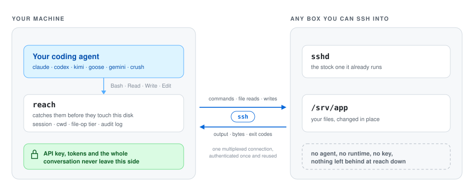

# AgentReach

**Point your coding agent at any box you can SSH into. The server never gets your agent.**

[](https://github.com/bojieli/agentreach/actions/workflows/ci.yml)
[](https://go.dev)
[](LICENSE)
[](go.mod)

<p align="center">
  <picture>
    <source media="(prefers-color-scheme: dark)" srcset="docs/assets/architecture-dark.svg">
    
  </picture>
</p>

## Why this exists

Think about the last time you SSHed somewhere to fix something. A build box, a
client's staging VM, a container you spun up this morning and will throw away
tonight. You'd get through it faster with an agent riding along.

So you install one there. That's a 300 MB Node binary on a machine that isn't
yours, plus an API key pasted in so the thing can actually do anything. Now your
key lives on a box where other people have root, in a shell history you won't
clear, in an env file you'll forget about by Friday. If that server gets popped
next month, your key goes with it.

Dev containers are the same story on repeat. New branch, new container, and each
one wants its own copy of the agent. Baking it into the Dockerfile bloats an
image that should have stayed small. Mounting it in from the host works right up
until the morning it doesn't.

## What reach actually does

The agent stays where it is. What moves is the work it hands off. An agent only
touches a machine two ways: it shells out to run a command, and it reads or
writes files. reach gets in the middle of both, on your side, before either one
reaches your disk.

The shell is the easy half. Most harnesses ship a supported way to replace
whatever they spawn as a shell, so reach uses it. Claude Code has
`CLAUDE_CODE_SHELL_PREFIX`. Goose has `GOOSE_SHELL`. Codex speaks a
remote-environment protocol. opencode lets a custom tool shadow a built-in one.
Where nothing like that exists, reach puts its own `bash` earlier on `PATH` and
wins the lookup. Whichever door it comes in through, the command gets unwrapped,
sent over ssh and run on the target. As far as the model can tell, it called
`Bash` and got back stdout and an exit code.

Files depend on the mode. In exec mode the agent's own `Read`, `Write` and `Edit`
are switched off, because they call the local filesystem directly and there's no
seam to redirect them through. The agent falls back to its shell, which is
already remote. In mirror mode reach answers those calls itself, pulling the file
over the same ssh connection when a tool opens it and pushing it back when it
changes. That path is wired up for Claude Code today.

Worth being precise about what this isn't. reach doesn't trace syscalls and it
doesn't mount anything. It sits at the seam where the agent hands work to the
operating system, one request and one response at a time.

## What it looks like

```console
$ reach up ssh://build-box/srv/app
probing ssh://build-box/srv/app ...
session "default" -> ssh://build-box/srv/app
  target   Linux x86_64
  fileops  pipe (negotiated; nothing written to the target)
  search   ripgrep (fast, structured)
  connect  multiplexed (one authenticated connection, reused)

$ reach claude
> what's eating disk on this box?
```

Claude Code is running locally. The `df` and `du` and `grep` it decides to run
happen on `build-box`. Files it reads come from `build-box`. If it rewrites a
config, the new bytes land on `build-box`. Your own filesystem is untouched
unless you specifically ask for something local.

Everything it did is on the record:

```console
$ reach log
WHEN      ACTION  STATUS  DETAIL
14:02:11  exec    ok      df -h /
14:02:19  exec    ok      du -sh /var/log/*
14:02:30  write   ok      /srv/app/logrotate.conf
14:02:31  exec    exit 1  systemctl reload rsyslog
```

## Install

```console
go install github.com/bojieli/agentreach/cmd/reach@latest
```

Pre-built binaries are on the [releases page](https://github.com/bojieli/agentreach/releases).
From source:

```console
git clone https://github.com/bojieli/agentreach
cd agentreach
make install
```

There is also a container image on GitHub Packages, for when the machine you
drive agents from is itself disposable — a CI job, a devcontainer, a jump box:

```console
docker run --rm -v "$HOME/.ssh:/root/.ssh:ro" ghcr.io/bojieli/agentreach version
```

It carries an `ssh` client and the helper binaries for every target platform.
Your keys and `known_hosts` have to be mounted in; there is nothing useful to
bake into an image, and reach will not invent credentials it was not given.

The only thing reach needs is the `ssh` binary you already have. It shells out
to that rather than speaking SSH itself, so `ProxyJump`, `IdentityFile`, `Match`
blocks, hardware tokens and 2FA all keep working the way you've configured them.

You can sit in front of Linux, macOS or Windows. Targets can be anything POSIX
you can reach over `ssh://`, `docker://`, `podman://`, or the usual
`user@host:/path` shorthand.

## Quick start

Point reach at something:

```console
reach up ssh://build-box/srv/app                     # a server you own
reach up ssh://client-box/srv/app --untrusted        # somebody else's server
```

This opens one multiplexed SSH connection and asks the host what it can do.
`--untrusted` promises that the optional helper binary will never be installed
there, no matter what. Either way, `reach doctor` will tell you exactly what was
found, which tier got picked, and whether anything is sitting on the target.

Then start your agent:

```console
reach claude       # Claude Code
reach codex        # Codex
reach goose        # Goose
```

It launches locally, with its shell quietly redirected to the remote host, and
you talk to it like you always do.

When you're finished:

```console
reach down
```

That closes the connection and leaves nothing behind.

## Agents that work today

| Agent | Command | Where reach gets in | Status |
|---|---|---|---|
| [Claude Code](docs/harnesses/claude-code.md) | `reach claude` | `CLAUDE_CODE_SHELL_PREFIX`, a hook it already ships | verified end-to-end (2.1.233) |
| [Codex](docs/harnesses/codex.md) | `reach codex` | its remote-environment protocol, which carries every tool it has | verified end-to-end (0.148.0) |
| [Kimi Code](docs/harnesses/kimi.md) | `reach kimi` | a patched npm bundle plus `KIMI_SHELL_PATH` | verified (0.37.2) |
| [opencode](docs/harnesses/opencode.md) | `reach opencode` | custom tools that shadow the built-in `bash` and `read` | verified (1.18.18) |
| [Goose](docs/harnesses/goose.md) | `reach goose` | `GOOSE_SHELL`, a documented override | verified |
| [Crush](docs/harnesses/crush.md) | `reach crush` | its own server mode, run on the target | verified |
| [Gemini CLI](docs/harnesses/gemini.md) | `reach gemini` | a `bash` earlier on `PATH`, plus `excludeTools` for the rest | verified |

Those fall into three groups, plus one exception, and the group decides how much
of the agent survives the trip.

Codex and opencode are the clean ones. Both document a way to change the machine
their tools act on, so reach answers at the other end and the model keeps every
tool it started with. Codex is the best fit reach has, because it has no file
tools at all: `apply_patch` and the rest run as commands inside `exec_command`,
so intercepting that one protocol leaves nothing behind to deny.

Claude Code, Goose and Kimi hand over the shell and only the shell. Their file
tools call straight into Node's `fs` or Rust's `std::fs`, so reach denies them
and the agent works through its shell instead, or in Claude Code's case mirrors
them if you ask for mirror mode.

Gemini gives you no hook at all, so reach wins the `PATH` lookup for `bash` and
hides the rest of the built-ins through `excludeTools` in a managed
`settings.json`.

Crush is the exception to the nothing-installed rule. Its server mode is exactly
the seam reach wants, and `reach crush` starts `crush server` on the target and
tunnels the client to it, which means `crush` itself has to already be there.

Whichever group you land in, nobody logs in again. Subscription logins, OAuth
tokens and API keys keep working exactly as they do now, because reach never
touches them.

## Commands

```console
reach up <target>       bind a session to a target and probe what it supports
reach down [session]    close a session and leave no trace
reach status            show active sessions
reach doctor            explain what a target supports, and why
reach log               what reach has run and changed on the target
reach exec -- <cmd>     run a one-off command there
reach fs read <path>    work with remote files directly
reach helper uninstall  remove anything reach put on the target
```

Targets look like this:

```
ssh://user@host/path/to/work
user@host:/path/to/work        (scp-style shorthand)
docker://container/path
podman://container/path
local:///path                  (this machine, mostly for testing)
```

## Things that look like they should work

| | what actually happens |
|---|---|
| **Install the agent on the server** | 300 MB of Node, and your API key is now on a machine you don't administer |
| **SSHFS or a FUSE mount** | macOS wants a kernel extension and a reboot. Worse, on a flaky link the mount hangs in uninterruptible sleep and the agent freezes mid-call with no error it can see |
| **An MCP file server** | The model now sees `mcp__remote__read_file` where it expected `Read`. You didn't relocate the agent, you retrained it |
| **Just SSH inside the agent's terminal** | `cd` stops persisting between calls, relative paths drift, and the agent's file tools are still happily editing your laptop |

There's one rule underneath all of this:

> Every failure has to arrive as a value the agent can reason about, never as a
> process that stops answering.

A timeout should show up as a tool error the model can retry or route around.
That's the reason reach is request/response over SSH instead of a filesystem
mount, and it's the thing most of the design falls out of.

## How it works

Three layers, and only the top one knows which agent you're running.

```
harness  (claude · codex · kimi · opencode · goose · crush · gemini)
    │     native tool calls, no new tools in the model's view
adapter   one per harness, config or plugin, never a fork
    │
reach     session state · cwd · capability probe
    │     file-op tier: posix · pipe · helper
    │  ssh · docker · podman · local
target    stock sshd, nothing installed
```

There's no daemon. A session is just a file on disk. SSH's `ControlMaster`
already multiplexes the connection at four to five times the speed of
reconnecting, so a daemon would buy lifecycle complexity and nothing else.

By default nothing gets written to the target. Two of the three file-operation
tiers touch its disk zero times, and those two are the only ones reach will
choose on its own. The third uploads a small helper, and only if you ask for it
by name.

| tier | needs on target | writes to target | chosen automatically |
|---|---|---|---|
| `posix` | a POSIX shell | nothing | yes, as fallback |
| `pipe` | `python3` | nothing | yes, preferred |
| `helper` | can run an uploaded binary | one cached binary | never |

[TRANSPORTS.md](docs/TRANSPORTS.md) has the numbers, measured over real links
rather than loopback.

## Choosing a mode

`exec` is the default, and it's the one to stay on unless you have a reason not
to. `--mode mirror` earns its keep during heavy editing sessions, when you'd
rather use Claude Code's native file tools than push every change through a shell
redirect:

```console
reach up ssh://build-box/srv/app --mode mirror
reach claude
```

Mirror keeps a content digest for each file it hands over, so if the file changed
on the server between the read and the write, the write is refused rather than
clobbering someone else's work. Go in knowing what it is, though: reads can be a
little stale, and it copies on demand rather than syncing. For shell-shaped work
exec is simpler and has no staleness window at all.

## Security

reach assumes the target might be hostile, and the design reflects that.

Your credentials never make the trip. The agent, its API key and the whole
conversation stay on your machine.

SSH agent forwarding is off and stays off. A forwarded agent socket on a hostile
server lets whoever controls that server authenticate as you everywhere else you
can reach, which is a much bigger blast radius than the session you thought you
were opening. reach never enables it and there is no flag that does.

Nothing is installed by default. Tier 0 needs a POSIX shell and writes nothing at
all.

The agent's shell snapshot gets stripped out of forwarded commands. Claude Code's
command envelope sources a file from your home directory, and shipping that to
the server would hand over your username and directory layout for no benefit.

What reach can't do anything about is prompt injection. Content from the target
flows into the agent's context, and a compromised server can absolutely try to
talk to your agent. Keep secrets out of the agent's local environment, and read
anything it writes to your local disk during a remote session. The full threat
model is in [docs/SECURITY.md](docs/SECURITY.md).

## Docs

| | |
|---|---|
| [ARCHITECTURE.md](docs/ARCHITECTURE.md) | how the pieces fit, and which alternatives got thrown out |
| [TRANSPORTS.md](docs/TRANSPORTS.md) | the three file-operation tiers, benchmarked on real links |
| [RESEARCH.md](docs/RESEARCH.md) | what each agent does internally, with transcripts |
| [SECURITY.md](docs/SECURITY.md) | threat model, and what reach won't save you from |
| [WINDOWS.md](docs/WINDOWS.md) | running reach from Windows |
| [CONTRIBUTING.md](CONTRIBUTING.md) | the standard of evidence, and the design rules |
| [harnesses/](docs/harnesses/) | per-agent notes: the seam, verified versions, known limits |

## Development

```console
make check        # vet plus unit tests. No network, no API key.
make integration  # every file-operation tier against a real sshd
make bench        # what each tier actually costs
make conformance  # do the agent seams still have the shape reach expects?
make e2e          # real agents against a real target (spends tokens)
```

`make integration` starts an sshd owned by your own user on a high port. No root,
no Docker, no outbound network. If you'd rather test against a box you already
have, set `REACH_TEST_SSH_HOST=my-box`.

## Status

The Claude Code path is verified end-to-end against a real agent on real hosts
across three continents. The file-operation layer has been through three tiers,
six hosts, three userlands and a fuzzer, and it's solid. Every other agent is
exactly as far along as [its notes](docs/harnesses/) say it is.

Interfaces may still move before 1.0. Three things won't: the file-operation
protocol, the session format, and the promise that nothing lands on your server
unless you asked for it.

## Acknowledgements

reach exists because [Zihan Zheng](https://github.com/zzh1996) (@zzh1996)
proposed the idea.

## License

MIT. See [LICENSE](LICENSE).
